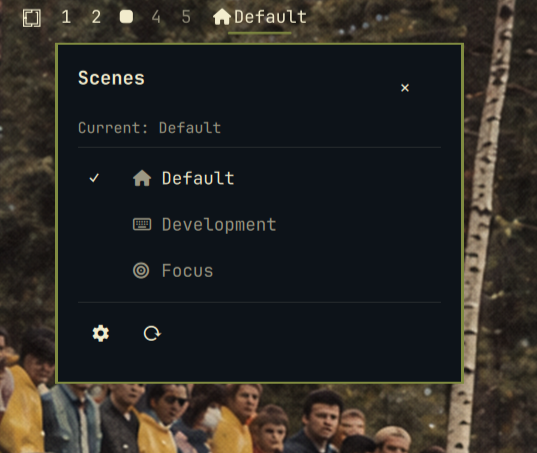
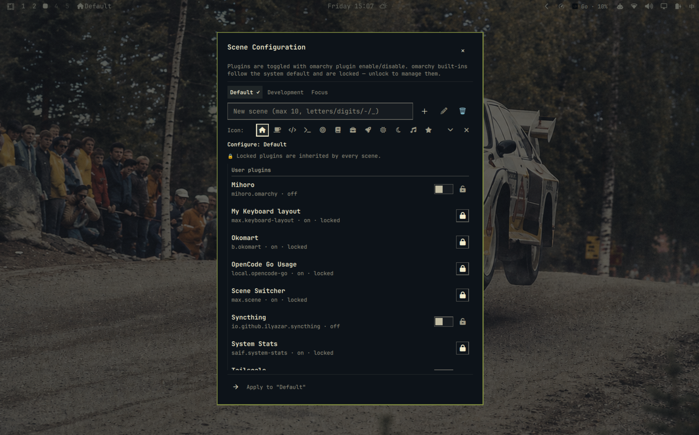

# Scene Switcher

Show the current omarchy scene in the bar with an icon, click to switch
scenes, and manage per-scene plugin sets from a centered configuration panel.

Scenes let you switch your bar/plugin set by occasion — Development at a
cafe, Focus at a desk — with one click or keypress instead of editing
`shell.json` every time.

## Screenshots





## Features

- **Bar widget** — current scene icon + label; left click opens the switch popup
- **Scene switching** — `omarchy-scene set <scene>` applies a scene by
  atomically rewriting `~/.config/omarchy/shell.json` (positions/settings of
  enabled plugins are cached and restored on re-enable). The **default set is
  the base**: its plugins stay enabled in every scene, and every scene runs
  default + locked + its own plugins. Plugins in no scene are unmanaged and
  never touched — including omarchy built-ins, which follow the system state.
- **Config panel** — lazy-loaded centered overlay (destroyed on close):
  scene tabs, create/rename/delete (max 5 custom scenes, names ≤10 chars),
  per-scene plugin toggles, lock/unlock buttons, and a preset icon picker
  (30 icons) for each scene. Plugin toggles are **marks**: they take effect
  together when you press **Apply & switch** (marked rows show a "pending"
  suffix; switching scene tabs or data refreshes discard unapplied marks)
- **Refresh plugins** — a ⟳ button at the bottom-left of the panel
  rescans the plugin registry, so plugins newly installed through
  `omarchy plugin add`/`clone` appear immediately
- **Status echo** — each row shows the plugin's effective state: locked
  plugins and omarchy built-ins follow the system default; plugins in a scene
  show the scene switch state; unmanaged (new) plugins echo their system
  default on/off
- **Locked plugins** — locked plugins are inherited by every scene (always on),
  on top of the default base set; omarchy built-ins are listed after user
  plugins, locked by default and following the system state — unlock them to
  manage manually
- **Keybinding** — `SUPER + SHIFT + S` cycles scenes
- **Menu integration** — optional "Scenes" submenu in the omarchy menu

## Install

Requires `python3` (stdlib only — used for the descriptor-bound secure I/O core).

The repository ships an idempotent `install.sh` that installs the plugin, the
companion CLI at the path the widget calls, and bootstraps the scene config
(`init` runs only when `scenes.json` does not exist yet — existing config is
always kept). Either:

```sh
# One command, straight from the marketplace (install.sh ships inside the
# cloned plugin, so no repo checkout or curl|bash needed):
omarchy plugin add https://github.com/gmaxxxie/Scene-Switcher.git --enable \
  && "$HOME/.config/omarchy/plugins/max.scene/install.sh"
```

```sh
# …or from a clone of this repository:
git clone https://github.com/gmaxxxie/Scene-Switcher.git
cd Scene-Switcher && ./install.sh
```

Manual, the same three steps are:

```sh
# 1. Install the plugin (from the marketplace URL or this repository)
omarchy plugin add https://github.com/gmaxxxie/Scene-Switcher.git --enable

# 2. Install the companion CLI from the cloned plugin folder.
#    The bar widget calls it at exactly $HOME/.local/bin/omarchy-scene — the
#    file was cloned with the plugin, so take it from there (not from the
#    current directory, which is not the repository).
install -Dm755 "$HOME/.config/omarchy/plugins/max.scene/omarchy-scene" "$HOME/.local/bin/omarchy-scene"

# 3. Bootstrap the scene configuration (snapshots your currently enabled set)
omarchy-scene init
```

After `init`, `~/.config/omarchy/scenes/scenes.json` holds the scene
definitions, `entries.json` caches plugin entry snapshots, and
`ui-state.json` is the rendered state the panel's FileView watches.

To update a previous install, either re-run `install.sh` (skips what is
already present) or run `./sync.sh` from a fresh clone of this repository —
it deploys the plugin folder **and** reinstalls the CLI in one step (see
Development).

The bar widget and config panel only ever consume the CLI-validated
`ui-state.json` payload — never the raw `scenes.json` directly. `edit`
revalidates and refreshes that state when you close the editor; any other
change to `scenes.json` shows up on the next `omarchy-scene` command that
regenerates it (add/set/label/icon/refresh/…).

## Usage

- Click the bar widget (or press `SUPER + SHIFT + S`) to switch scenes
- Click the ⚙ button in the popup to open the configuration panel
- Pick the scene tab, toggle plugins, lock/unlock, set an icon, then press
  **Apply & switch** — toggles are only **marks** until then

## How scenes compose

- **default** is the base set — `init` snapshots your currently enabled
  **user** plugins (omarchy built-ins are never snapshotted; they stay
  unmanaged and follow the system state). The default set's plugins stay
  enabled in **every** scene.
- **locked** plugins are inherited everywhere too (always on) — lock a
  plugin to pin it to all scenes, on top of the default base.
- **scene-specific** plugins belong to one scene and switch with it.
- **unmanaged** plugins (in no scene, not locked — including omarchy
  built-ins) are never touched by scene switches; they keep whatever state
  they have.

So switching to a scene runs **default + locked + that scene's plugins**.
To stop a plugin everywhere, remove it from the default set
(`omarchy-scene rm-plugin default <id>`) and disable it at the shell level.

Toggling a plugin switch in the config panel only **marks** it (row shows a
`(pending)` suffix). **Apply & switch** commits all pending marks in one
transaction via `omarchy-scene apply <scene> --on <ids> --off <ids>`:
enable/disable, scene membership, then switch. Marks are discarded when you
switch scene tabs or the panel data refreshes.

## Configure

```sh
omarchy-scene list                                    # scenes + members
omarchy-scene set <scene>                             # switch (drop --dry-run to apply)
omarchy-scene apply <scene> --on <ids> --off <ids> # apply marked toggles + switch (panel)
omarchy-scene add <name> --label <label> --icon <glyph>
omarchy-scene rename <old> <new>                      # rename a scene (keeps its label)
omarchy-scene toggle-plugin <scene> <plugin-id> on|off
omarchy-scene lock/unlock <plugin-id>                 # inherit everywhere / release
omarchy-scene icon <scene> <glyph>                    # empty glyph clears the icon
omarchy-scene status                                  # per-plugin current vs target state
omarchy-scene refresh                                 # re-snapshot managed plugin entries
omarchy-scene menu-add / menu-remove                  # bar menu submenu
```

## Keybinding

The widget installs `SUPER + SHIFT + S` -> `omarchy-scene cycle` in
`~/.config/hypr/bindings.lua`; remove that line to uninstall the binding.

## Remove

```sh
omarchy plugin remove max.scene
rm -rf ~/.config/omarchy/scenes           # scene config (optional)
rm -f ~/.local/bin/omarchy-scene          # companion CLI (optional)
```

## Security

The plugin and its CLI run unsandboxed with your user permissions. The CLI
only calls `omarchy plugin enable/disable`, rewrites `~/.config/omarchy/`
files atomically (backing up `shell.json` before each switch), and issues a
reload query to the running shell. It never uses `sudo`, starts no extra
Quickshell process, and sends no network traffic.

All file I/O is **descriptor-bound** — there is no check-then-open anywhere:

- Every read opens the path **once** via `openat(2)`, walking each path
  component with `O_NOFOLLOW` (`O_DIRECTORY` on intermediate directories),
  then validates with `fstat(2)`: regular file, owned by the current user,
  size ≤ 8 MiB. Reads use `O_NONBLOCK` + `S_ISREG` so a hostile FIFO at a
  config path can never block the CLI. A symlink pointed at a config path
  (or any component of it) is refused with `ELOOP`, and the validated bytes
  are captured from that descriptor — later tools (`jq`/`awk`/`sed`/`grep`)
  only ever consume the in-memory content via stdin, never the mutable
  pathname.
- Writes create a random temp file in the **same directory** as the target
  with `O_CREAT|O_EXCL` and keep its descriptor open for the whole
  create → write → validate → `fchmod` → `fsync` → atomic `rename(2)`
  sequence (rename bound to the validated parent-directory descriptor, so a
  directory switch mid-operation cannot redirect the publish). The temp
  pathname is never reopened by `cat`/`stat`/`chmod`/`sync`.
- Backups copy descriptor-to-descriptor into a random `O_EXCL` name in the
  same directory (timestamp + random suffix) — no predictable paths, no
  collisions — and auto-prune in place: each switch keeps only the newest
  `$OMARCHY_SCENES_BACKUPS` (default 10) of its own `shell.json.bak.*`
  backups. Files belonging to other tools (e.g.
  `shell.json.bak.opencode.*`) are never touched.
- Mutating commands hold an `flock(2)`-based mutex whose lock file is opened
  atomically (`O_CREAT` + `O_NOFOLLOW`) and whose holder dies with its parent
  (`PR_SET_PDEATHSIG`), so a crashed CLI never leaves a stale lock.
- Structural limits are enforced on the validated read before anything is
  emitted to QML: 8 MiB byte cap, JSON depth ≤ 32, strings ≤ 4096 chars,
  array/object member counts ≤ 65536; `scenes.json` — at most 12 scenes,
  scene keys ≤ 10 chars (`[a-zA-Z0-9_-]`), labels ≤ 64 chars, icons ≤ 4
  chars, plugin lists ≤ 256 entries, plugin ids
  `^[a-zA-Z0-9][a-zA-Z0-9._-]{0,63}$`; `entries.json` ≤ 4096 records;
  catalog-derived fields (`name` ≤ 128, `id` ≤ 64, `kinds` ≤ 16×32); menu
  actions are bounded by the scene-key limit.
- The `.reopen-config` refresh marker is written through the same
  descriptor-bound core (O_EXCL temp + atomic rename): a pre-placed
  symlink is refused, never followed or truncated. It is cleared by
  `omarchy-scene reopen-done`, which writes `0` back through the same
  core (the marker stays a 1-byte regular file so the widget never sees a
  missing-file read; a hostile symlink/FIFO marker is instead unlinked,
  link-only) — neither the CLI nor the widget ever uses shell redirection
  on that path.
- Each scene remembers its exact bar layout (`_layouts` snapshots), so
  switching default ↔ dev restores the arrangement precisely every time and
  unmanaged built-in widgets (wifi/ai/audio/monitor/power, …) are never
  pushed out of place by index drift.

## Development

This repository is the source of truth. The live plugin folder
(`~/.config/omarchy/plugins/max.scene`) is a deployed copy — edit here, then
deploy (the shell hot-reloads on save):

```sh
./sync.sh          # deploy the plugin folder + reinstall the CLI to ~/.local/bin
bash tests/run-tests.sh   # security/regression suite (135 checks)
omarchy plugin validate .   # spec validation before pushing
```

The test suite covers symlink rejection, TOCTOU swap races, FIFO
non-blocking, oversized files, concurrent writers, backup collisions, menu
shell-injection attempts, structural limit enforcement, lock safety,
byte-level round-trips, layout stability, and reopen-marker symlink
safety — all in a sandboxed fake `$HOME` with stubbed
`omarchy`/`omarchy-shell` binaries.

## License

MIT — see [`LICENSE`](LICENSE).